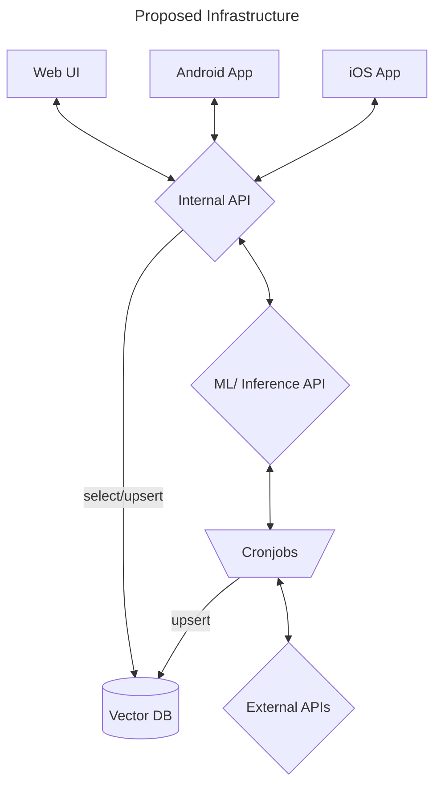
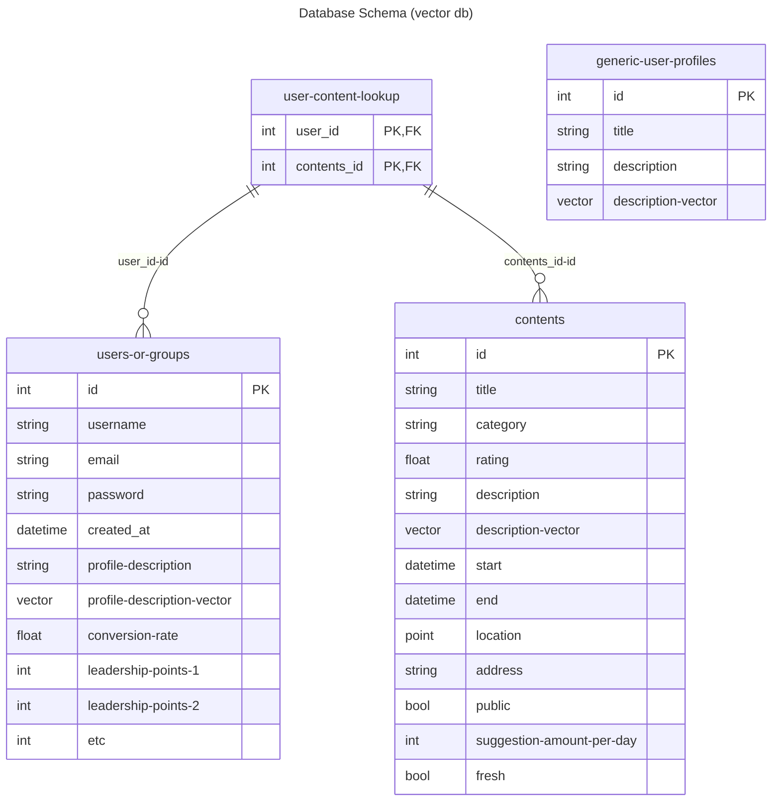

## Current Infrastructure
- PostgreSQL database
- Drupal backend (PHP)
    - Content management system
- React/Next.js frontend (JavaScript)
    - Web UI
- Python script (web scraping)

## Proposed Infrastructure
- Database
    - It is suggested to use some form of vector database to store the user and content vectors. Open to suggestions on this, I have had pretty ok experiences with Milvus, Qdrant, and Chroma in the past.
    Here are some options:
        - [Milvus](https://milvus.io/)
        - [Qdrant](https://qdrant.tech/qdrant-vector-database/)
        - [Weaviate](https://weaviate.io/developers/weaviate)
- Internal API
    - It is suggested to use a RESTful API to interact with the database. In the end I think the best suggestion it to use FastAPI as it is a python framework that also supports websockets (which we may want to use for real-time updates in the future).
    Here are some options:
        - [FastAPI](https://fastapi.tiangolo.com/)
        - [Django REST framework](https://www.django-rest-framework.org/)
        - [Flask](https://flask.palletsprojects.com/en/2.0.x/)
- Web UI
    - The main decision here is whether we want to use a build once deploy everywhere framework like React/Next.js or Flutter, or if we want to build separate web and mobile apps. I would suggest the former as it is easier to maintain and develop for. React makes sense as the frontend development is already in React... however there will need to be some changes to the current codebase to make it work with React Native most likely.
        - React/Next.js (React Native can be used for mobile apps)
        - Flutter (this can be used for both Android and iOS as well)
        - Angular
        - Vue.js
        - Svelte
- Android App
    - The same decision as the Web UI applies here. I would suggest using Flutter as it is easier to maintain and develop for.
        - Flutter
        - React Native
        - Kotlin
- iOS App
    - The same decision as the Web UI applies here. I would suggest using Flutter as it is easier to maintain and develop for.
        - Flutter
        - React Native
        - Swift
- cronjobs
    - This is a bit of a tricky one. I would suggest using a separate service for this, but it could be done in the API as well. The cronjobs will be used to update the vectors in the database and to update the user and content vectors based on the user's interactions with the system. Here are some options for running the cronjobs if we don't do from the API:
        - [Github Actions](https://github.com/features/actions)
        - [AWS Lambda](https://aws.amazon.com/lambda/)
        - [Google Cloud Functions](https://cloud.google.com/functions)
        - [Azure Functions](https://azure.microsoft.com/en-us/services/functions/)
    - For the code in the cronjobs themselves, I would suggest `httpx` for making the requests to the API and the python library for the vector database we choose.
        - [httpx](https://www.python-httpx.org/)
        - [requests](https://docs.python-requests.org/en/master/)
        - [aiohttp](https://docs.aiohttp.org/en/stable/)
    - If we do end up needing to scrape anything I would suggest using:
        - [Playwright](https://playwright.dev/python/docs/intro), or perhaps
        - [Scrapy](https://scrapy.org/)
- External APIs
    - For the MVP this is what Brian has indicated:
        - **1st priority**
            - Restaurants & Things to do
                - [Tripadvisor](https://www.tripadvisor.com/developers)
            - Experiences
                - [Viator](https://partnerresources.viator.com/)
                - [GetYourGuide](https://partner.getyourguide.com/)
            - Hotels & Activities
                - [Hotelbeds](https://developer.hotelbeds.com/)
            - Flights, Accommodation, and Activities
                - [Duffel](https://duffel.com/)
        - **2nd priority**
            - Local transportation and accommodation.
                - [Car Hire](https://pages.discovercars.com/b4b)
                - [Train tickets](https://silverrailtech.com/)
                - [Hotels and Apartments](https://apaleo.com/open-apis)
        - **More Flights for later**
            - [Air getaway](https://airgateway.com/)
            - [Amadues](https://developers.amadeus.com/)
            - [Sabre](https://www.sabre.com/products/suites/developer-experience/sabre-apis/)
            - [Travel Port](https://www.travelport.com/products/api)
- ML/ Inference API
    - There are two ways this could be done, we could use a lightweight model that runs in the internal API and the cronjobs services themselves (this would be the easiest to implement), or we could use a separate service for this. For example chroma uses a very small LLM as a default model, and we could use that directly. However, if we want to use a more complex model we could use [litserve](https://lightning.ai/docs/litserve/home/get-started)(also built on top of FastAPI) to serve the model. This would allow us to easily scale the model as needed.
    - Or for the MVP we could just say that we want to outsource this to an external API like:
        - [OpenAI](https://platform.openai.com/docs/guides/embeddings)
        - [MixedBread](https://www.mixedbread.ai/api-reference/quickstart)
        - [Nomic](https://www.nomic.ai/blog/posts/nomic-embed-text-v1)

