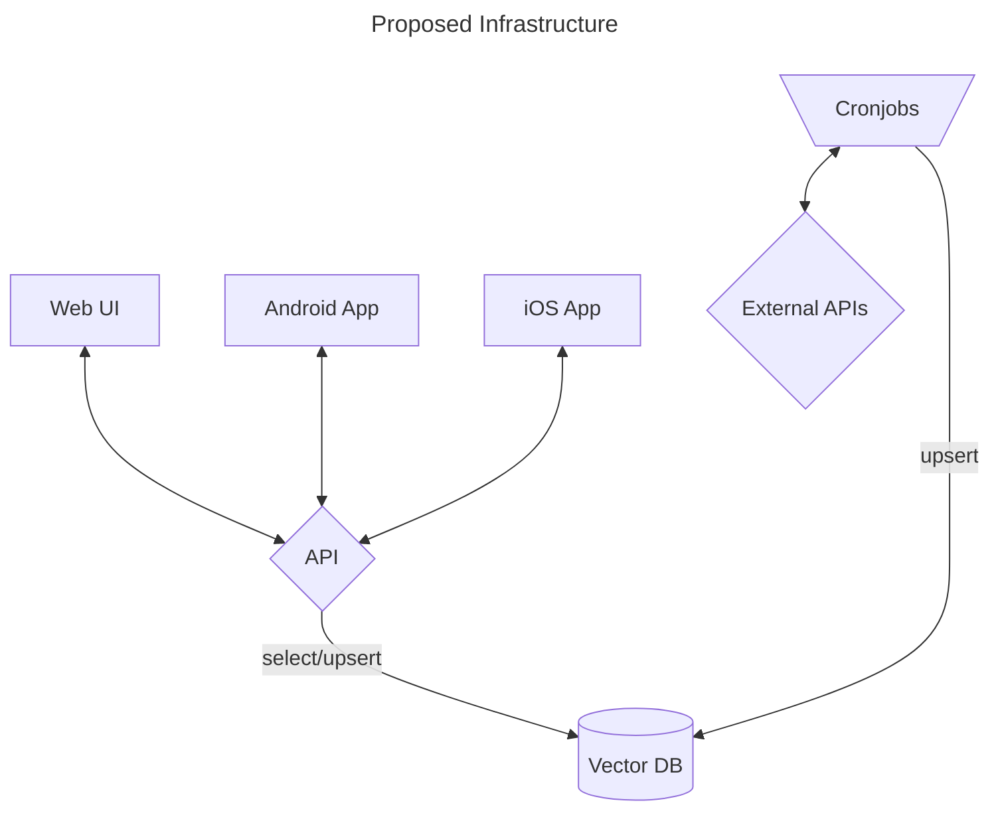
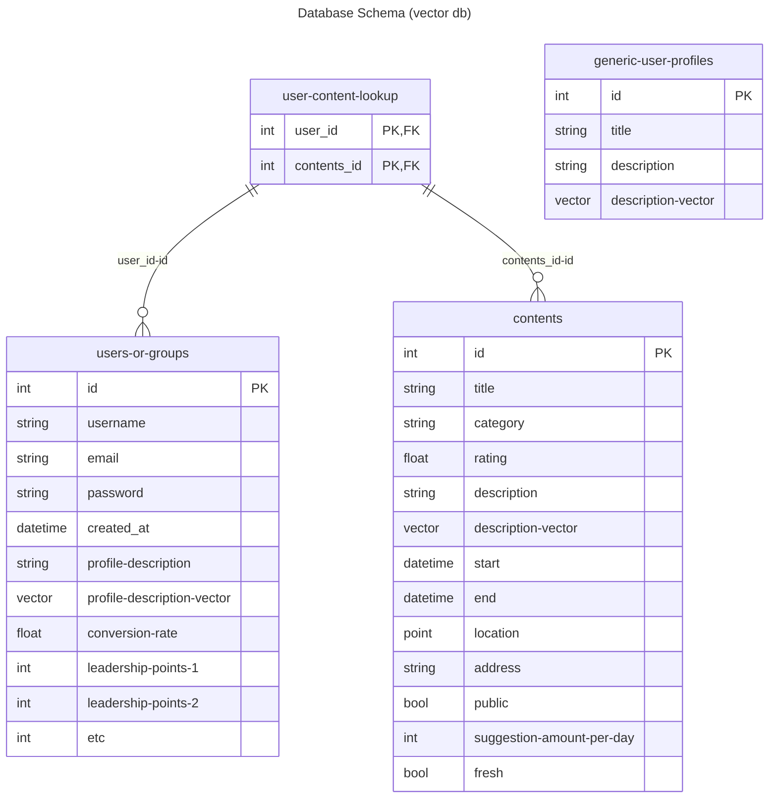

```mermaid
---
title: Proposed Infrastructure
---
flowchart TD
    A[Web UI] & B[Android App] & C[iOS App] <--> F{API}
    F -->|select/upsert| D[(Vector DB)]
    E[\Cronjobs/] ---->|upsert| D
    E <--> G{External APIs}
```

```mermaid
---
title: Database Schema (vector db)
---
erDiagram
    user-content-lookup ||--o{ users-or-groups : user_id-id
    user-content-lookup ||--o{ contents : contents_id-id
    users-or-groups {
        int id PK
        string username
        string email
        string password
        datetime created_at
        string profile-description
        vector profile-description-vector
        float conversion-rate
        int leadership-points-1
        int leadership-points-2
        int etc
    }
    contents {
        int id PK
        string title
        string category
        float rating
        string description
        vector description-vector
        datetime start
        datetime end
        point location
        string address
        bool public
        int suggestion-amount-per-day
        bool fresh
    }
    generic-user-profiles {
        int id PK
        string title
        string description
        vector description-vector
    }
    user-content-lookup {
        int user_id PK,FK
        int contents_id PK,FK
    }
```